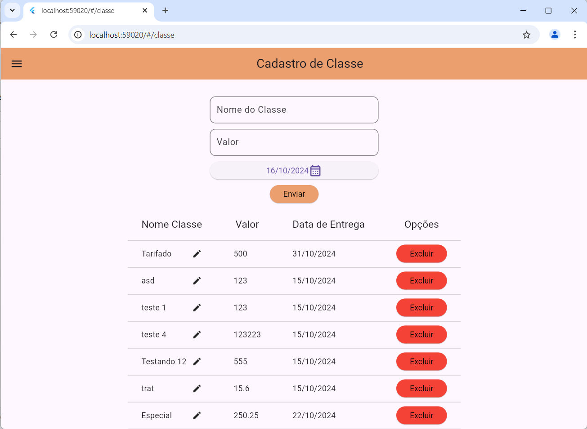

<h1>Locadora</h1>

Essa locadora tem o objetivo de enriquecer as  habilidades de desenvolver full-Stack. Sendo que o projeto será produzido tanto o Front quanto o Back de forma simultaneamente.

O frontend está sendo desenvolvido em <b>Flutter</b> para Web.

Já o Backend está sendo desenvolvido em <b>Spring Boot</b>

A foto acima exibe a tela de cadastro de Classe.

